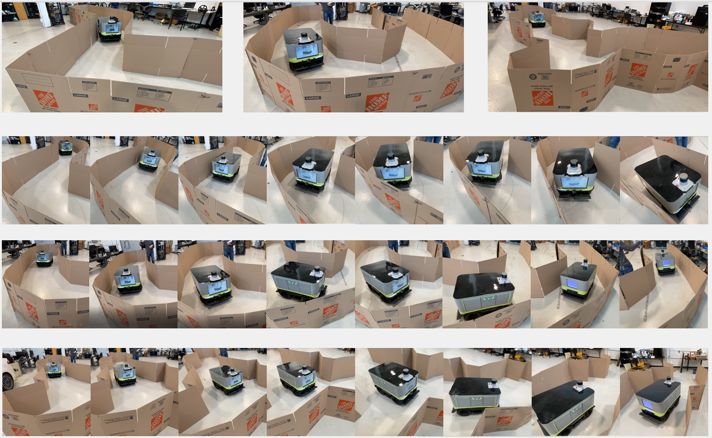

# "Reinforcement Learning for Self-exploration in Narrow Spaces"
by Zhaofeng Tian | [Website](https://sites.google.com/view/rl4exploration) | [Video](https://youtu.be/7TB-1-NkQPw) | [Paper](https://arxiv.org/pdf/2209.08349.pdf)

 

## RL Algorithms
This repo includes five RL algorithms that benchmarked in the paper. 
To work the code on your local machine, you may need appopriate APIs to OpenAI gym and ROS. 
In our case, we run the code with our [tailored gazebo simulator](https://github.com/Zhaofeng-Tian/ZebraT-Simulator) for our robot ZebraT.
More details may be published later.

## Reference
1. [ZebraT Simulator](https://github.com/Zhaofeng-Tian/ZebraT-Simulator)
2. [RL with Phil](https://www.youtube.com/c/MachineLearningwithPhil)
